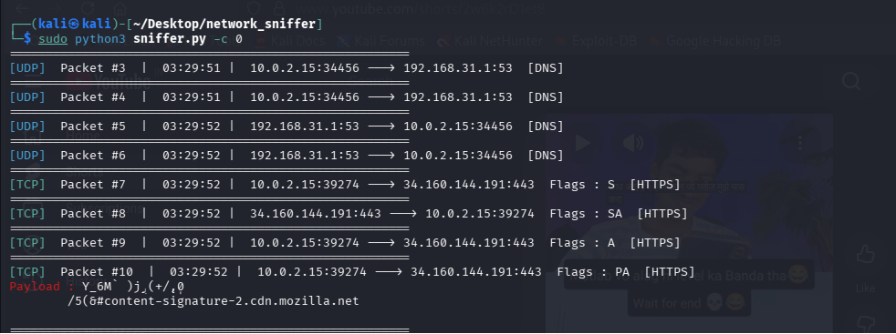
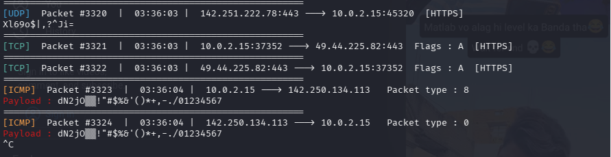

# Basic Network Sniffer

A Python-based packet sniffer built with Scapy that captures live network traffic and displays protocol details in real time. Built as part of the CodeAlpha Cybersecurity Internship — Task 1.

## Overview

This tool captures packets flowing through a network interface and breaks down their structure — showing source/destination IPs, ports, protocol type, TCP flags, and any readable payload data. It's a hands-on way to understand how data actually moves across a network at the packet level.

## Features

- Live packet capture using Scapy
- Protocol identification for TCP, UDP, and ICMP
- Common service detection by port number (HTTP, HTTPS, DNS, SSH, FTP, SMTP, POP3, IMAP, MySQL, RDP)
- TCP flag inspection (SYN, ACK, PSH, etc.)
- Payload extraction and decoding for readable text (e.g. HTTP traffic)
- Packet numbering and per-packet timestamps
- Color-coded terminal output for quick visual scanning
- Configurable packet capture count via command line

## Requirements

- Python 3.8+
- Linux environment (Kali Linux recommended) — raw socket capture requires a Unix-based system with root access
- Root/sudo privileges

## Installation

```bash
pip install scapy colorama
```

## Usage

Run with root privileges, since raw packet capture requires elevated access:

```bash
sudo python3 sniffer.py -c 20
```

### Arguments

| Flag | Description | Default |
|------|-------------|---------|
| `-c`, `--count` | Number of packets to capture (0 = capture indefinitely) | 0 |

### Example

```bash
sudo python3 sniffer.py -c 50
```

Captures 50 packets and prints details for each as they arrive.

## Sample Output

```
=======================================================
[HTTPS]  Packet #1  |  14:23:45  |  192.168.1.5:54231 ---> 142.250.80.46:443  Flags : PA  [HTTPS]
=======================================================
[DNS]  Packet #2  |  14:23:46  |  192.168.1.5:55102 ---> 8.8.8.8:53  [DNS]
=======================================================
[ICMP]  Packet #3  |  14:23:47  |  192.168.1.5 ---> 192.168.1.1   Packet type : 8
```


## How It Works

1. **Capture** — `scapy.sniff()` listens on the network interface and passes each captured packet to a callback function.
2. **Filter** — Non-IP packets (e.g. ARP) are skipped to focus on IP-based traffic.
3. **Identify** — The packet is checked for TCP, UDP, or ICMP layers to determine its protocol.
4. **Enrich** — Known port numbers are mapped to common service names (e.g. port 443 → HTTPS) for easier reading.
5. **Display** — Source/destination IPs, ports, flags, and payload (if present) are printed in a color-coded, timestamped format.

## Project Structure

```
sniffer.py      # Main script — capture, parse, and display logic
README.md       # Project documentation
```

## Notes

- This is a learning-focused, basic packet sniffer — it inspects and displays traffic but does not modify, block, or inject packets.
- Designed and tested on Kali Linux. Raw socket access for live capture is OS-dependent and works most reliably on Unix-based systems.
- Use only on networks and systems you own or have explicit permission to monitor. Unauthorized packet sniffing may violate local laws and organizational policies.

## Task Reference

Built to satisfy the following requirements:
- Build a Python program to capture network traffic packets
- Analyze captured packets to understand their structure and content
- Learn how data flows through the network and the basics of protocols
- Use libraries like `scapy` for packet capturing
- Display useful information such as source/destination IPs, protocols, and payloads

## Author

Aadarsh Sapkal
- GitHub: [Aadarsh7776](https://github.com/Aadarsh7776)
- LinkedIn: [aadarsh-sapkal](https://linkedin.com/in/aadarsh-sapkal-09590a293)